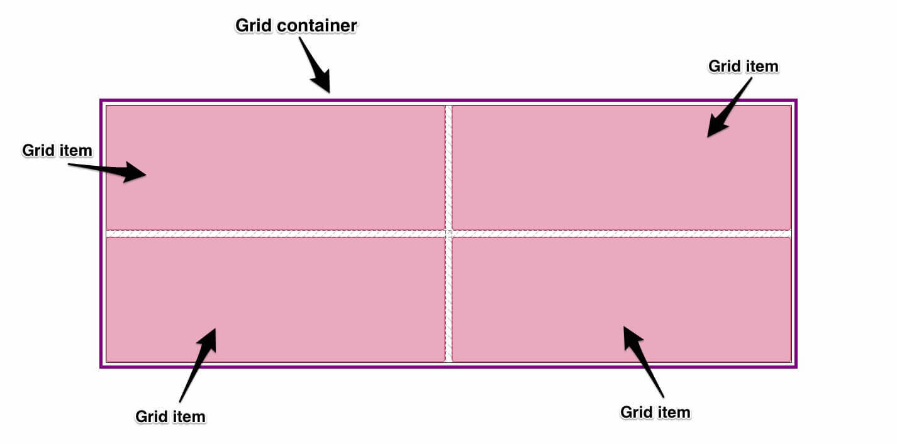
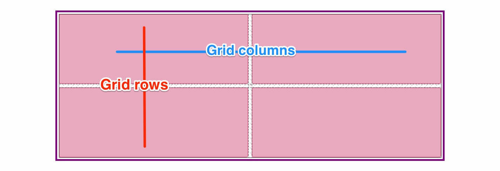

# Intro to CSS Grid

## Learning Objectives
- Study the basic concepts of CSS Grid Layout
- Apply those concepts by building our own grids in Codepen
- Identify common pitfalls and misconceptions
- Equip ourselves with a variety of learning resources

## The Fundamentals of CSS Grid Layout
So what is CSS Grid? An actual, bona fide, honest-to-God **two-dimensional layout** in CSS. Here's what we get right out of the box:
- **P**recise item placement
- **I**mplicit grid
- **V**ertical and horizontal alignment
- **O**verlapping content
- **T**rack sizing

Yes, you read that correctly: we can now **PIVOT**.


> This isn't an industry-approved acronym, but it works and you may find it helpful. Also, I really wanted to use this gif, okay? Okay.

### Containers and Items and Tracks, Oh My!
We'll do some PIVOTing shortly, but first, let's establish a working vocabulary.

For starters, we have a parent element: the **GRID CONTAINER**. Any direct children of that parent element are **GRID ITEMS*. 



Grid items can be placed in **GRID COLUMNS** and **GRID ROWS**. Together these columns and rows define **GRID TRACKS**.



If this seems abstract right now, don't worry. It will get clearer as we build this stuff ourselves. Time to fire up Codepen.

### Example #1: Declaration of Gridependance 
🔗 Codepen: [Getting started](https://codepen.io/solomonkane/pen/938ef9695f92af67c8284049be1410a8)

Declaring a grid is simple. Just set `display: grid` on our grid container - in this case, the div with the clever class name `.grid` - and _voila!_ We're done. Ship it.

Okay, maybe don't ship it _quite_ yet. Nothing has really changed about the appearance of our grid; the divs are still stacked on top of each other like before. Let's take a closer look... in Firefox.

> Say hello to the **Firefox Grid Inspector**. It's powerful, easy to use, and nicer than anything currently available in Chrome DevTools. It can help us visualize our layouts and prevent debugging-induced baldness. Basically, it's awesome. Read more about it [here](https://developer.mozilla.org/en-US/docs/Tools/Page_Inspector/How_to/Examine_grid_layouts).

After popping open Firefox DevTools, we can see `display: grid` did, in fact, change _something_. There's a "grid" marker next to our `<section>`. There's also a ~~tiny waffle~~ grid icon next to our declaration in the Rules pane. Groovy. Our grid does exist after all.

Turns out, what we're missing is a column declaration. Let's add `grid-template-columns: 500px 500px` to our grid container.

That's more like it. Now we have a grid with 2 columns, each 500px wide. We can even shorten our declaration with the `repeat()` function, like so: `grid-template-columns: repeat(2, 500px)`.

We're using pixels here, but any length unit is a viable option: rems, ems, percentages, you name it. We can even mix these units: `grid-template-columns: 33% 100px 20vw 15rem 4em` is a perfectly valid rule, believe it or not.

Grid also brings a new unit of measurement to CSS: the `fr` unit represents a fraction of the available space in a grid container, and it's here to make our grid tracks flexible AF. Let's use it: `grid-template-columns: repeat(2, 1fr)`.

> ⚠️ `fr` will always defer to fixed units. If we write `grid-template-columns: 250px 1fr`, 250px will be taken out of the available space, and the remaining space goes to the `fr`. In other words, if other units are eating the grid, `fr` only gets the leftovers.

Columns are great, but isn't Grid all about two-dimensional control? Where are our rows? 

We can define rows using - you guessed it - `grid-template-rows`. As with columns, any length unit (or combination of length units) is fair game.

Last but not least, we can define gutters with `grid-row-gap` and `grid-column-gap`... or with the shorthand `grid-gap`.

Now let's PIVOT.

> _[discuss grid cells? some of these topics will overlap with each other, but that's okay, the goal is to be an introducton and get people excited about Grid]_

## Precise item placement
Grid allows us to get super specific about where items live in our grid container. We can do this with line numbers, named lines, and grid areas.

### Example #2: Numbers, Names, and Areas
🔗 Codepen: [Precise item placement](https://codepen.io/solomonkane/pen/7a803d257a3a65e479bf824a70a1095c)

Using `grid-column-start` and `grid-column-end`, we can tell grid items which column to occupy. If we want to specify the row, we can use `grid-row-start` and `grid-row-end`.

> These properties can be shortened to `grid-column` and `grid-row`, respectively. Just provide the starting and ending values, seperated by a slash: `grid-column: 1 / 2`.

Let's switch things up for `grid__item--rogue`.

#### Using line numbers

```css
.grid__item--rogue {
  grid-column: 2 / 3;
  grid-row: 3 / 4;
}
```

> _[mention `span 1` and `-1`]_

#### Using named lines

```css
.grid {
  grid-template-columns: [col-1-start] 1fr [col-1-end col-2-start] 1fr [col-2-end];
  grid-template-rows: [row-1-start] 1fr [row-1-end row-2-start] 1fr [row-2-end row-3-start] 1fr [row-3-end];
}

.grid__item--rogue {
  grid-column: col-1 / col-2;
  grid-row: row-2;
}
```

#### Using grid areas
Say hello to `grid-template-areas`. This property allows us define grid areas with ascii art: each word represents a column and each line represents a row.

```css
.grid {
  grid-template-columns: 2fr 2fr 1fr 2fr;
  grid-template-rows: 1fr 1fr 1fr;
  grid-template-areas:
          "right left"
          "right left"
          "bottom bottom";
}

.grid__item--rogue {
  grid-area: bottom;
}
```

You can probably already see how powerful grid areas would be with something like [site layout](https://codepen.io/solomonkane/pen/3c7e2d965ff468fbe294b585142aa379?editors=1100).

**Bonus**: [CSS Grid Gallery](https://codepen.io/solomonkane/pen/VEyWQO)

## Implicit grid
Setting explicit positions for grid items is cool, but not always what you want. Generally, you'll have maybe a couple grid items you want to explicitly place, and you want everything else to just... fall into place, with as little thinking on your part as possible. Wouldn't that be a dream?

_[extremely Kevin Flynn voice]_ Welcome to the (implicit) grid.

We've already seen this feature in action. In our first grid example, we didn't explictly position _any_ of the grid items, and they still "magically" arranged themselves into columns and rows. This is possible thanks to CSS Grid's auto-placement rules. When we create a grid, each grid item is automatically placed in a cell on the first row. When there's no more room on the explicit grid, a new implicit row is created.

Whenever you're building a grid, therefore, it's important to think in terms of both explicit and implicit grids.

### Example #3: Explicit vs Implicit
🔗 Codepen: [Explicit Grid vs Implicit Grid](https://codepen.io/solomonkane/pen/ad1ce44713514030614a96eebef6c7bc)

Right now, we have six items laid out on a 3x2 grid. Everything fits snugly within the _explicit_ grid. But what happens if we add a seventh item?

Since there's no room in the explicit grid, a brand new row is created for us. This row is part of the implicit grid, _because we didn't define it._ Grid does that for us.

> If you're unsure about where the explicit grid ends and the implicit grid begins, Firefox Grid Inspector differentiates between two. The solid black line indicates around your items means the explicit grid. The very small dotted line means the implicit grid.  

As you can see, the new implicit row is sized differently. By default, all rows on the implicit grid are auto-sized. They're just big enough to house the content inside of them without overflow. We can control the size of implicit rows with the `grid-auto-rows` property. Check it out: `grid-auto-rows: 100px`. Now all of our rows - explicit and implicit - are the same size.

The default flow in Grid is to arrange by row. We can change this by setting `grid-auto-flow: column`. Remember in Flexbox how we can control `flex-direction`? It's just like that. Now any items that can't fit on the explicit grid will be placed in implicit columns.

- _[mention other cool values like `column dense`]_

### Vertical and horizontal alignment
One of the most common misconceptions about Grid is that it replaces Flexbox. _It does not._ You can and should use both together, as they're meant to solve different problems. Flexbox is intended for one-dimensional layouts - you want horizontal **or** vertical control. Grid is intended for two-dimensional layouts - you want horizontal **and** vertical control.

To better understand this difference, let's look at an example. (Rachel Andrew and MDN both use variations of this example, so you know it's a good one.)

### Example #4: "You are traveling through another dimension..."
🔗 Codepen: [One-Dimensional vs Two-Dimensional](https://codepen.io/solomonkane/pen/96ea9b0fd828481a8fa04c0f13fd16f8)

On the left we have a "grid" with Flexbox. (It's not a real grid, as we'll soon see, hence the scare quotes.) We've got `flex-wrap: wrap` on the parent, and `flex: 1 1 150px` on the children. That means the children can grow and shrink, with a `flex-basis` of 150px. Everything looks pretty good until we get to the fifth item. Instead of lining up under the items above it, it stretches to fill the entire container. 

This isn't a bug. It's how Flexbox works. When our flex item wraps, it creates a new row, and that new row becomes a new flex container. The same applies if we're working with columns in Flexbox. 

In some cases, this may be exactly what you want. In other cases, not so much. That's where Grid steps in.

On the right, we have a grid with CSS Grid. With `grid-template-columns: repeat(2, 1fr)`, we already have a truer grid than we had with Flexbox. Our fifth item is properly lined up nicely under the other items.

In one sense, then, a good question to ask yourself when deciding whether to use Flexbox or Grid is: do I need vertical and horizontal alignment in my layout? If you need both, Grid is your best bet. If you just need one, Flexbox is probably what you want.

Another question to ask is: content out or layout in?

If you want to lay out a bunch of items out, without necessarily lining up, and let _content_ dictate the size of each item... Flexbox is perfect for that.

But Grid works from the _layout_ in. You create a grid, then place items in it - or let auto-placement do for you. Either way, the items are laid out according to the grid. It has a stricter, less flexible relationship to the content.

So if you find yourself trying to make Flexbox less flexible, maybe you should use Grid instead. If you find yourself trying to make Grid more flexible than it is, maybe Flexbox is what you need.

- _[include note about justify-content, justify-items, align-content, align-items?]_

### Overlapping content
- less to say about this, as I haven't use it much, but it's still pretty cool
- may replace the need for `position: absolute` in certain cases

### Track sizing
- the almighty minmax()

## Other Considerations
- Browser support
- Accessibility

## Learning Resources
### Theory & Reference 📚
- [Get Ready for CSS Grid](https://abookapart.com/products/get-ready-for-css-grid-layout) by Rachel Andrew
- [Grid by Example](https://gridbyexample.com/)
- [CSS Grid Layout | MDN](https://developer.mozilla.org/en-US/docs/Web/CSS/CSS_Grid_Layout)
### Practice 💪
- [CSS Grid Garden](http://cssgridgarden.com/)
- Jonas Schmedtmann's [Advanced CSS and Sass](https://redventures.udemy.com/advanced-css-and-sass/learn/v4/overview)
- Wes Bos' [CSS Grid Course](https://cssgrid.io/)
### Tools 🛠
- [Firefox Grid Inspector](https://developer.mozilla.org/en-US/docs/Tools/Page_Inspector/How_to/Examine_grid_layouts)
